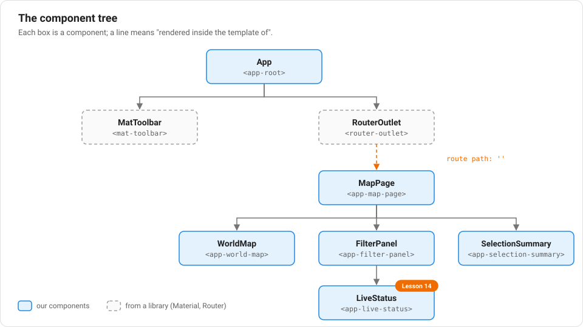

# Lesson 3: Your first component

## What is a component?

A **component** is one self-contained, reusable piece of the page. Think of
a button, a card, a toolbar, or — in our app — the whole map, or the filter
panel. Each component owns three things:

1. A **class** — plain TypeScript, holding data and logic
2. A **template** — the HTML that class controls
3. **Styles** — CSS that only applies to that component

Look at the root component of our app, in `src/app/app.ts`:

```ts
import { Component } from '@angular/core';
import { RouterOutlet } from '@angular/router';
import { MatToolbarModule } from '@angular/material/toolbar';
import { MatIconModule } from '@angular/material/icon';

@Component({
  imports: [RouterOutlet, MatToolbarModule, MatIconModule],
  selector: 'app-root',
  styleUrl: './app.css',
  templateUrl: './app.html',
})
export class App {}
```

Breaking this down:

- `@Component({...})` is a **decorator**. A decorator is a function, written
  with an `@` in front, that attaches configuration to the thing right below
  it — here, the `App` class. It doesn't change what's inside the class; it
  tells Angular "here's how to treat this class."
- `selector: 'app-root'` means this component appears in HTML as
  `<app-root></app-root>`. Look inside `src/index.html` — that's the only
  tag in the whole file's `<body>`. Everything else in the app eventually
  renders inside it.
- `templateUrl` / `styleUrl` point at the HTML and CSS files for this
  component (`app.html` and `app.css`, sitting right next to `app.ts`).
- `imports: [...]` lists everything this component's template is allowed to
  use — other components, or (as here) prebuilt Angular Material pieces like
  a toolbar and icons. This is part of the "standalone components" style
  from Lesson 2: instead of a shared list of imports for the whole app, each
  component says exactly what it needs.

## The template

`src/app/app.html`:

```html
<mat-toolbar color="primary">
  <mat-icon>public</mat-icon>
  <span class="app-title">Equality Map</span>
</mat-toolbar>

<main>
  <router-outlet />
</main>
```

`<mat-toolbar>` and `<mat-icon>` are Angular Material components (Lesson 11
covers those properly). `<router-outlet />` is special: it's a placeholder
that says "whatever page is currently active goes here" — that's the subject
of the next lesson.

## How the app actually starts

Open `src/main.ts`:

```ts
import { bootstrapApplication } from '@angular/platform-browser';
import { appConfig } from './app/app.config';
import { App } from './app/app';

bootstrapApplication(App, appConfig).catch((err) => console.error(err));
```

This is the very first code that runs. `bootstrapApplication` tells Angular:
"start the whole app from this one component (`App`), using this
configuration (`appConfig`)." Every other component in the app exists
because, directly or indirectly, `App`'s template asked for it.

## Components form a tree

Once you have more than one component, they nest: `App`'s template contains
`<router-outlet>`, which will render a page component, whose template
contains more components, and so on. This is the **component tree** — the
same idea as the DOM tree, but at the level of your own building blocks
instead of raw HTML tags.

Here is the whole tree for Equality Map, as it is by the end of this series:



The dashed boxes aren't ours: they come from libraries (Angular Material and
the Angular Router). They appear in templates and nest into the tree exactly
like our own components do. The orange line is special: `RouterOutlet`
doesn't name `MapPage` in its template. The Router decides at runtime which
component goes there, based on the URL (next lesson).

## New terms in this lesson

- **Component** — a self-contained class + template + styles that renders
  part of the page.
- **Decorator** (`@Component(...)`) — a function that attaches configuration
  to the class below it.
- **Selector** — the custom HTML tag name a component is used by (e.g.
  `app-root`).
- **Component tree** — the nested structure formed by components containing
  other components.

Next: [Lesson 4 — Giving your app pages: routing](./04-routing.md)
