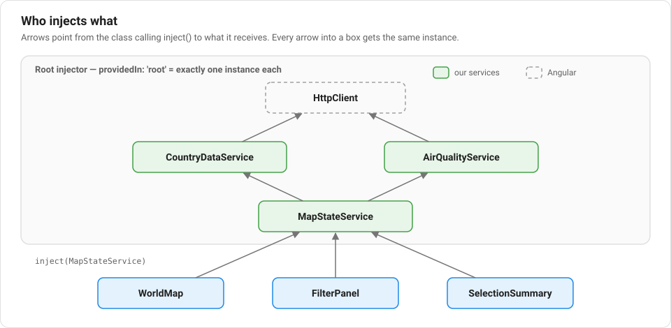

# Lesson 6: Services and Dependency Injection

## What is a service?

A **service** is a class whose job is *not* to render anything — it's for
logic and data that components need but shouldn't each have to reimplement.
Our `CountryDataService` (`src/app/core/services/country-data.service.ts`) is
a good example: it's the one place in the app responsible for knowing about
countries, indicators, and scores. Components ask it for data; they don't
know or care where that data actually comes from.

```ts
@Injectable({ providedIn: 'root' })
export class CountryDataService {
  private readonly countries: Country[] = buildCountryGeometry(worldAtlas, MOCK_COUNTRIES);

  getCountries(): Observable<Country[]> {
    return of(this.countries);
  }
  // ...
}
```

## The `@Injectable` decorator

Like `@Component` in Lesson 3, `@Injectable` is a decorator — it tells
Angular "this class can be handed out to whatever asks for it."
`providedIn: 'root'` means: create exactly **one instance** of this class for
the whole app, and share it everywhere it's used. This single shared
instance is called a **singleton**.

## Dependency Injection

Here's the problem DI solves: if `WorldMap`, `FilterPanel`, and
`SelectionSummary` all need country data, you *could* have each one create
its own `new CountryDataService()`. But then each would have its own copy of
the data, and there'd be no single source of truth. Instead, Angular has a
built-in system called **Dependency Injection (DI)**: a class declares what
it needs, and Angular finds (or creates) the right instance and hands it
over.

You'll see this written as `inject(...)`, for example in
`src/app/core/services/map-state.service.ts`:

```ts
private readonly countryData = inject(CountryDataService);
```

This single line does the same thing as if we'd written the (much messier)
code to look up the registered `CountryDataService` instance ourselves.
Because it's `providedIn: 'root'`, every class that calls
`inject(CountryDataService)` gets back the *exact same object* — that's what
lets our whole app share one copy of the country data without passing it
around manually.

Services can inject other services, too. Here is every `inject()` in the
app:



The **injector** is the part of Angular that creates these instances and
keeps track of them. Note `HttpClient` at the top: it's a service that
Angular itself provides (Lesson 14), and we get it with `inject()` like any
other.

## Why this matters for testing too

Because components ask for a service instead of creating one directly,
tests can hand a component a *fake* version of that service instead of the
real one — useful for testing UI in isolation from real data-fetching logic.
Lesson 15 does something similar: instead of faking our own service, the
tests swap Angular's real HTTP backend for a testing one, so no test ever
touches the network.

## New terms in this lesson

- **Service** — a class that holds logic/data, meant to be shared rather than
  rendered.
- **`@Injectable`** — the decorator marking a class as available through DI.
- **Singleton** — an object that only ever has one shared instance across the
  whole app.
- **Dependency Injection (DI)** — Angular's system for handing classes the
  service instances they ask for, instead of them creating their own.
- **`inject(SomeService)`** — asks Angular's DI system for the shared
  instance of `SomeService`.
- **Injector** — the part of Angular that creates service instances and
  hands them out.

Next: [Lesson 7 — Fetching data the Angular way: Observables](./07-observables.md)
