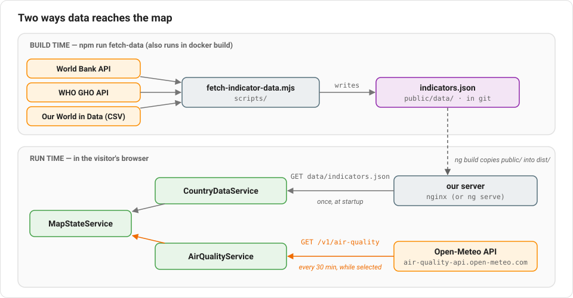

# Lesson 14: Talking to real APIs

Until now, every number on the map was made up and typed in by hand. This
lesson replaces them with real data from public **APIs** (web addresses that
return data instead of web pages). Along the way it covers the tools you'll
use in almost any Angular app that talks to a server: `HttpClient`, typed
responses, error handling, and fetching again on a schedule.

## First question: how often does the data change?

Before writing any code, look at how often each dataset actually changes.
The answer decides *when* the app should fetch it:

| Indicator | Source | Changes | When we fetch it |
|---|---|---|---|
| Income inequality (Gini) | World Bank | about once a year, per country | at **build time** |
| School completion, water, undernourishment | World Bank | about once a year | at **build time** |
| Health service coverage | WHO | every couple of years | at **build time** |
| LGBTQ+ legal equality | Equaldex via Our World in Data | when laws change | at **build time** |
| Air pollution right now | Open-Meteo | **every hour** | **live**, in the browser |

It would be easy to fetch everything live, but for data that changes once a
year that only brings downsides. Every visitor would wait for four slow
third-party servers on every page load. The map would break whenever one of
them has an outage. And every visitor would count toward those services'
request limits. So the slow-changing data is downloaded **once**, saved as a
file, and shipped with the app. Only the air-quality data, which really
does change hour to hour, is fetched live.



## Part 1: Fetching data at build time

`scripts/fetch-indicator-data.mjs` is a plain Node.js script, not part of the
Angular app. You run it with:

```bash
npm run fetch-data
```

It downloads each indicator and writes everything into one file,
`public/data/indicators.json`. That file is committed to git, so the app
always builds, even without internet access. Refreshing the data is a
deliberate step: run the script, look at what changed, commit it. (Lesson 16
also runs the script inside `docker build`, so each deploy gets fresh data.)

### Three APIs, three shapes, one adapter each

Every API returns its data in a different shape. The World Bank sends a
two-item array, `[paginationInfo, rows]`; the WHO sends `{ value: rows }` with
columns named `SpatialDim` and `NumericValue`; Our World in Data sends a CSV
file. The script gives each one a small **adapter** function that turns that
source's shape into the one the app already understands, the `CountryScore`
from Lesson 5:

```js
async function fetchWorldBank(indicatorCode) {
  const url = `https://api.worldbank.org/v2/country/all/indicator/${indicatorCode}?format=json&mrnev=1&per_page=1000`;
  const [, rows] = await getJson(url);
  return rows
    .filter((row) => row.value != null)
    .map((row) => ({ countryIso3: row.countryiso3code, value: row.value, year: Number(row.date) }));
}
```

`mrnev=1` asks for each country's "most recent non-empty value". This is a
reminder that real data is messy: many countries only measure inequality
every few years, so the Gini values range from 2010 to 2025. The script drops
anything older than 2010, and the filter panel shows the range of years
under the indicator picker, so nobody mistakes the map for one year's data.

### Why `public/`?

Angular copies everything in `public/` into the build output unchanged. So
`public/data/indicators.json` ends up next to `index.html`, and the running
app can load it from `data/indicators.json`, from our own server. That
brings us to how Angular makes HTTP requests.

## Part 2: `HttpClient`

### Turning it on

`HttpClient` is a service (Lesson 6), and it has to be registered before
anything can `inject()` it. That's one line in `src/app/app.config.ts`:

```ts
providers: [
  provideBrowserGlobalErrorListeners(),
  provideRouter(routes),
  provideHttpClient(withFetch()),
],
```

`withFetch()` has `HttpClient` use the browser's modern `fetch()` function
under the hood.

### The payoff from Lesson 7

In Lesson 7, `CountryDataService` wrapped its mock data in `of()`, with a
promise that switching to real network requests later wouldn't change how
the rest of the app used it. Here's that switch, in
`src/app/core/services/country-data.service.ts`:

```ts
// before
getIndicators(): Observable<IndicatorDefinition[]> {
  return of(INDICATORS);
}

// after
private readonly http = inject(HttpClient);
private readonly snapshot$ = this.http.get<DataSnapshot>('data/indicators.json').pipe(/* ... */);

getIndicators(): Observable<IndicatorDefinition[]> {
  return this.snapshot$.pipe(map((snapshot) => snapshot.indicators));
}
```

The method still returns an `Observable<IndicatorDefinition[]>`, so
`MapStateService`, which reads it with `toSignal()` (Lesson 10), didn't have
to change at all. The data just arrives a few milliseconds later than it
used to. Until then, the signal holds its `initialValue` of `[]`, and the
map stays grey for a moment.

### `get<T>()` is a promise, not a check

`http.get<DataSnapshot>(url)` tells TypeScript "trust me, the response looks
like `DataSnapshot`". Nothing checks this at runtime. If the file had a
different shape, TypeScript wouldn't notice, and you'd find out through
`undefined`s at runtime. For a file we generate ourselves, that's an
acceptable risk. For a third-party API, it's a good reason to keep the API's
shape confined to one adapter function, as Part 3 does.

### Observables are lazy, and `shareReplay` shares the result

`http.get()` doesn't send a request when you call it. It returns an
Observable, and the request goes out **each time something subscribes**.
Three methods read from this one file (`getIndicators`, `getAllScores`,
`getLocations`), so without extra care the same file would be downloaded
three times. `shareReplay(1)` fixes that:

```ts
private readonly snapshot$ = this.http.get<DataSnapshot>(SNAPSHOT_URL).pipe(
  catchError((error: unknown) => {
    console.error(`Could not load ${SNAPSHOT_URL}`, error);
    return of(EMPTY_SNAPSHOT);
  }),
  shareReplay(1),
);
```

`shareReplay(1)` makes all subscribers share a single request and **replays**
the last value (`1`) to anyone who subscribes later. `catchError` handles
failure: if the file can't be loaded, we log the error and carry on with an
empty snapshot. The map shows up grey instead of the whole page breaking.

## Part 3: A live API

The live indicator is "air pollution right now": the amount of fine dust
(PM2.5) in the air at each country's capital, from
[Open-Meteo](https://open-meteo.com/). Polluted air is an equality issue
too: it falls hardest on people in poorer countries and cities.

Before calling any API from the browser, check three things:

1. **Does it need an API key?** Anything shipped to the browser is public,
   so a secret key in Angular code isn't secret. APIs that need one have to
   be called from a server of your own. Open-Meteo needs no key.
2. **Does it allow requests from other websites (CORS)?** For security,
   browsers block a page from reading responses from another domain unless
   that domain explicitly allows it, with a header like
   `access-control-allow-origin: *`. Open-Meteo sends that header. Many APIs
   don't, and then they can only be used from a server. (Our build script runs
   in Node.js, not a browser, so CORS never applies to it.)
3. **What are the limits and terms?** Open-Meteo is free for non-commercial
   use with a daily request limit, and asks for attribution. That's why the
   app credits it under the indicator picker.

### Building the request

`src/app/core/services/air-quality.service.ts` asks about all ~170 capitals
in **one** request, because Open-Meteo accepts comma-separated lists of
coordinates. The coordinates come from the build-time snapshot (the World
Bank's country list includes each capital's latitude and longitude):

```ts
const params = new HttpParams()
  .set('latitude', locations.map((location) => location.latitude).join(','))
  .set('longitude', locations.map((location) => location.longitude).join(','))
  .set('current', 'pm2_5')
  .set('timezone', 'GMT');

return this.http.get<OpenMeteoLocation | OpenMeteoLocation[]>(API_URL, { params }).pipe(
  map((response) => { /* turn Open-Meteo's shape into CountryScore rows */ }),
);
```

`HttpParams` builds the `?latitude=...&longitude=...` part of the URL and
handles URL-encoding for you.

The response type, `OpenMeteoLocation | OpenMeteoLocation[]`, is honest
about a quirk of this API: when you ask about one location it returns a
plain object, and when you ask about several it returns an array. The
`map()` step handles both cases and converts the result into `CountryScore`
rows. Nothing outside this one method ever deals with Open-Meteo's
response shape.

### Fetching again on a schedule

`watch()` combines several RxJS operators to fetch readings now, every 30
minutes after that, and whenever the user clicks refresh:

```ts
watch(locations: CountryLocation[], refresh$: Observable<void>): Observable<LiveState> {
  return merge(timer(0, REFRESH_INTERVAL_MS), refresh$).pipe(
    switchMap(() =>
      this.fetchCurrent(locations).pipe(
        map(({ scores, measuredAt }) => ({ status: 'ready', scores, measuredAt, fetchedAt: new Date(), error: null })),
        retry({ count: 2, delay: 3000 }),
        catchError((error) => of({ status: 'error', error: describeError(error) })),
        startWith({ status: 'loading' }),
      ),
    ),
    scan((state, change) => ({ ...state, ...change }), INITIAL_LIVE_STATE),
  );
}
```

That's a lot of operators at once. This picture shows what each one does
over time:


Going through it piece by piece:

- **`timer(0, 30 min)`** emits right away, then every 30 minutes, forever.
- **`merge(a, b)`** produces one stream containing the values of both
  `a` and `b`: ticks from the timer, plus clicks on the refresh button.
- **`switchMap`** turns every tick into an HTTP request. If a new tick
  arrives while the previous request is still running, `switchMap`
  **cancels** the old one. The user never sees an old response arrive after
  a newer one.
- **`retry({ count: 2, delay: 3000 })`** re-sends a failed request up to
  twice more, 3 seconds apart. Networks fail now and then, so one failure
  shouldn't show an error straight away.
- **`catchError`** converts a final failure into an ordinary value,
  `{ status: 'error' }`. It sits *inside* `switchMap` for a reason: an
  error that reaches the outer stream ends it, which would stop the timer
  and all future refreshes along with it. Caught on the inside, only this
  one request has failed.
- **`startWith`** emits `{ status: 'loading' }` immediately, before the
  response arrives, so the UI can show a progress bar.
- **`scan`** works like `Array.reduce`, but over time: it merges each change
  into the previous state. That's how a failed refresh keeps the previous
  readings on the map instead of wiping them.

The result is a single `Observable<LiveState>` with everything the UI needs:
status, scores, when they were measured, and any error message.

### Only while it's on screen

There's no reason to call Open-Meteo while the user is looking at a
different indicator. `MapStateService` only subscribes to `watch()` while the
air-quality indicator is selected:

```ts
readonly liveState = toSignal(
  toObservable(this.activeIndicatorId).pipe(
    switchMap((indicatorId) =>
      indicatorId === AIR_QUALITY_INDICATOR.id
        ? this.countryData.getLocations().pipe(switchMap((locations) => this.airQuality.watch(locations, this.liveRefresh$)))
        : EMPTY,
    ),
  ),
  { initialValue: INITIAL_LIVE_STATE },
);
```

`toObservable()` is `toSignal()` in reverse: it turns a signal into an
Observable that emits every time the signal changes. Here's `switchMap`
again: every time the indicator changes, it drops the previous inner
Observable and starts the new one. For the air-quality indicator, that's the
live stream. For any other indicator, it's `EMPTY`, an Observable that
never emits anything. Switching away **unsubscribes** from the live stream,
which stops its timer and cancels any request still in flight. That's the
same mechanism `switchMap` used above to cancel a slow request.

The refresh button is wired to a **`Subject`**, an Observable you can push
values into yourself:

```ts
private readonly liveRefresh$ = new Subject<void>();

refreshLive(): void {
  this.liveRefresh$.next();
}
```

### Showing loading and error states

A real network request can be slow or fail, so the UI has to show that. The
new `LiveStatus` component (`src/app/features/filters/live-status/`) shows
a pulsing dot and the measurement time, a progress bar while loading, or the
error message, plus a refresh button. The template picks one with
`@switch`, which works like JavaScript's `switch` statement:

```html
@switch (state().status) {
  @case ('loading') { Fetching live readings… }
  @case ('ready') { Live · measured at {{ state().measuredAt | date: 'shortTime' }} }
  @case ('error') { {{ state().error }} }
}
```

`LiveStatus` is also the first component in the app that **doesn't** inject
`MapStateService`. It gets its data from its parent through an `input()` and
reports clicks back through an `output()`. Lesson 10 describes both
approaches, and this is the first time the app uses the second one.

## Things real data taught us

A few problems only showed up once the data was real:

- **Outliers distort color scales.** A single reading of 169 µg/m³
  stretched the color scale so far that every other country looked green.
  The air-quality indicator now has a fixed `colorScaleDomain` of 0 to 75
  µg/m³ (five times the WHO's daily guideline), and anything above 75 gets
  the "worst" color.
- **Some numbers go over 100%.** The school completion rate counts everyone
  who finishes, including students older than the official age group, so
  some countries reach nearly 150%. The script caps it at 100.
- **Not every country has every value.** Countries with no data stay grey.
  Some don't have a single agreed capital either, so the script falls back
  to the geographic centre of the country for its air-quality reading.

## Try it yourself

1. Open your browser's developer tools, go to the **Network** tab, and pick
   "Air pollution right now" from the indicator dropdown. You'll see one
   request to `air-quality-api.open-meteo.com`. Click it to see the
   response Open-Meteo sends. Then click the refresh button next to "Live" and
   watch a second request appear.
2. In the Network tab, set throttling to **Offline** and click refresh.
   After the two retries (about 6 seconds), the error state appears, but the
   map keeps its previous colors. That's `scan` at work.
3. Add a new indicator. In `scripts/fetch-indicator-data.mjs`, copy one of
   the World Bank entries in `INDICATORS` and change it to use
   `SG.GEN.PARL.ZS` (the share of seats in parliament held by women). Run
   `npm run fetch-data`, and it appears in the dropdown without any changes
   to the Angular code.

## A newer alternative: `httpResource()`

Newer versions of Angular also offer `httpResource()`, which makes a request
and exposes the result, loading state, and error as signals directly,
without RxJS. It's a good fit for simple "load this when that changes"
cases. We used plain `HttpClient` here because you'll see it in almost every
existing Angular codebase, and because RxJS operators like `switchMap`,
`retry`, and `timer` make the polling logic above short to write.

## New terms in this lesson

- **API** — a web address that returns data (usually JSON) for programs to
  use, rather than a page for people to read.
- **Build-time data** — data fetched once, while building the app, and
  shipped as a static file.
- **Adapter** — a small function that converts an outside data shape into
  your app's own shape, so the rest of the app never depends on it.
- **`HttpClient`** — Angular's service for making HTTP requests. Every
  method returns an Observable.
- **`HttpParams`** — builds a URL's query string with proper encoding.
- **CORS** — the browser rule that stops a page from reading another
  domain's responses unless that domain explicitly allows it.
- **Polling** — fetching the same data again on a schedule, to keep it
  current.
- **`shareReplay`** — lets many subscribers share one execution of an
  Observable (such as one HTTP request), and replays its result to anyone
  who subscribes later.
- **`switchMap`** — maps each value to a new Observable, cancelling the
  previous one.
- **`retry` / `catchError`** — try a failed Observable again, or replace the
  error with a normal value.
- **`scan`** — like `Array.reduce`, but emitting the running result every
  time a new value arrives.
- **`Subject`** — an Observable you can push values into yourself with
  `.next()`.
- **`toObservable()`** — turns a signal into an Observable (the opposite of
  `toSignal()`).

Next: [Lesson 15 — Testing your app](./15-testing.md)
