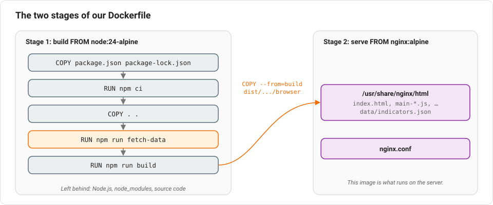

# Lesson 16: Packaging the app with Docker

This lesson is less about Angular specifically, and more about how to hand
a finished Angular app to a server so other people can actually visit it.

## The problem

`npm run build` (Lesson 2) produces a folder of plain HTML/CSS/JS files —
that's genuinely all a built Angular app is. But "a folder of files" isn't
by itself something a server knows how to serve to visitors, and building it
requires Node.js and all our npm dependencies to be installed first. We want
a way to package "build this app, then serve the result" into one
repeatable, portable unit. That's what **Docker** is for.

## Containers, images, and Dockerfiles

A **container** is a lightweight, isolated environment that runs a program
with exactly the operating system, tools, and files it needs — nothing from
your actual computer leaks in, and nothing it does affects your computer,
beyond what you explicitly allow (like a specific port). An **image** is the
packaged blueprint a container is started from. A **Dockerfile** is a text
file with step-by-step instructions for building that image.

## Our Dockerfile, explained stage by stage

```dockerfile
# --- Build stage: compile the Angular app ---
FROM node:24-alpine AS build
WORKDIR /app

COPY package.json package-lock.json ./
RUN npm ci

COPY . .
RUN npm run fetch-data || echo "fetch-data failed; building with the committed snapshot"
RUN npm run build

# --- Serve stage: static files behind nginx ---
FROM nginx:alpine

COPY --from=build /app/dist/equality-map/browser /usr/share/nginx/html
COPY nginx.conf /etc/nginx/conf.d/default.conf

EXPOSE 80
```

This is called a **multi-stage build** — it has two `FROM` lines, meaning two
separate images get built, and only the *result* of the first gets carried
into the second.



- **Stage 1 (`build`)**: starts from an image that already has Node.js
  installed (`node:24-alpine` — "alpine" means a stripped-down, small Linux
  base). It copies in just the dependency files first and runs `npm ci`
  (a stricter, more reproducible version of `npm install`, meant for exactly
  this kind of automated build). Copying dependency files before the rest of
  the source code is deliberate: Docker skips re-running a step if its
  inputs haven't changed, so if you only change your own code (not your
  dependencies), this `npm ci` step is skipped on your next build, saving a
  lot of time. Then it copies the rest of the source code, refreshes the
  indicator data (see below), and runs `npm run build`.
- **Stage 2**: starts fresh from `nginx:alpine` — **nginx** is a widely used,
  very lightweight web server, good at exactly one job: serving files fast.
  `COPY --from=build` reaches back into the first stage and grabs *only* the
  finished, built files (`dist/equality-map/browser`) — none of the Node.js
  tooling, source code, or `node_modules` from stage 1 end up in the final
  image at all. This keeps the final image small and doesn't ship your
  source code or build tools to production.

## Fresh data on every build

`RUN npm run fetch-data` runs the build-time data script from Lesson 14, so
each image ships with the latest World Bank, WHO and Our World in Data
numbers. The `|| echo "..."` part matters: in a shell, `a || b` means "run
`b` only if `a` failed". If those APIs can't be reached during the build,
the step prints a warning instead of failing, and the build continues with
the `public/data/indicators.json` already committed to git. An outage at the
World Bank should never stop you from deploying.

(For this to work, the script has to be inside the image. `.dockerignore`,
which lists files Docker should *not* copy in with `COPY . .`, used to
exclude the `scripts/` folder, so that line was removed.)

## Why a custom nginx config?

`nginx.conf`:

```
location / {
    try_files $uri $uri/ /index.html;
}
```

Remember routing (Lesson 4)? Our app has real-looking URLs handled entirely
by JavaScript in the browser, but nginx doesn't know that — by default, it
would look for a real file matching the URL and return "404 Not Found" for
anything that isn't `index.html` exactly. This one rule tells nginx: "if you
can't find a real file matching this URL, serve `index.html` anyway" — then
Angular's Router (running in the browser) takes over and shows the right
page. This is a standard requirement for deploying any SPA (Lesson 1),
not something specific to Angular.

## Docker Compose

Building and running a container by hand involves a fairly long command with
flags for ports, restart behavior, and so on. **Docker Compose** lets you
describe all of that once, in a file:

```yaml
services:
  equality-map:
    build: .
    ports:
      - '8080:80'
    restart: unless-stopped
```

`ports: '8080:80'` means "requests to port 8080 on the host machine get sent
to port 80 inside the container" (port 80 is what nginx listens on by
default, and is what we `EXPOSE`d in the Dockerfile). `restart: unless-stopped`
means the container automatically restarts if it crashes or the machine
reboots, unless someone deliberately stopped it.

## Running it

```bash
docker compose up -d --build
```

This builds the image (if needed) and starts the container in the
background (`-d`, for "detached"). The app is then available at
`http://localhost:8080` — or, on a real server, at that server's address.

## New terms in this lesson

- **Container** — an isolated environment for running a program with
  exactly the dependencies it needs.
- **Image** — the packaged blueprint a container is started from.
- **Dockerfile** — instructions for building an image.
- **Multi-stage build** — a Dockerfile with multiple `FROM` stages, where
  only specific output from earlier stages carries into the final image.
- **`.dockerignore`** — a list of files and folders that Docker leaves out
  when copying the project into an image.
- **nginx** — a lightweight, widely used web server, here used just to serve
  our built static files.
- **Docker Compose** — a tool for describing and running one or more
  containers from a single configuration file.

Next: [Lesson 17 — What to learn next](./17-whats-next.md)
